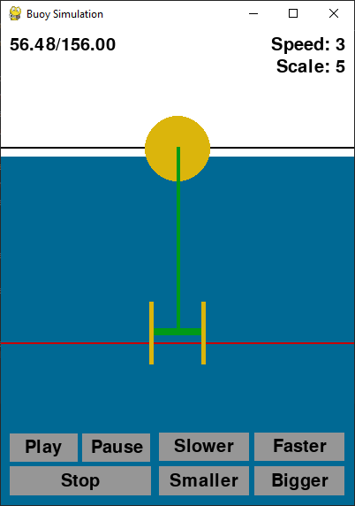

# IPS Buoy Simulation and Animation

This project is for the simulation and animation of an IPS (Interproject Services) Buoy. To most, the previous sentence probably doesn't mean much. To explain a little, an IPS buoy is a device created to extract energy from the motion of the waves. It is made up of two floating bodies interacting and power is developed from their relative motion.

## Usage
The project is built of two sections and languages:

1. The simulation part is written in MATLAB ("IPS_buoy_simulation.m"). In this script, parameters of the device and wave state are define, then the motion of the two bodies are calculated using rigid body mechanics and a few assumptions that would make a hydrodynamicist groan. 
2. The animation part is written in Python ("make_animation.py" / "make_animation.exe"), utilising the "pygame" package. This script / program takes in a ".mat" storage file produced in the first part and produces an interactive animation window.

Because no sane person likes fighting with python import errors, I've included a single file windows executable and a single directory executable. The single file .exe is more manageable to look at, but unpacking "pygame" takes a while. So the single directory serves to speed things up.

Whether run as the python script, or an executable, the program is run from the command line followed by the path of the ".mat" file. If no file is supplied, it will try to run the demo file "demo_file.mat".

### Running Animator as Python Script
``` shell
    >> python make_animation.py myfile.mat
```

### Running Animator as Single File Executable
``` shell
    >> make_animation.exe myfile.mat
```

### Running Animator as Python Script
``` shell
    >> make_animation\make_animation.exe myfile.mat
```

## The Model
In an IPS buoy there is two bodies. In yellow is the floating buoy and the acceleration tube, although not illustrated as so, they are rigidly connected and move as one. Drawn in green is the piston. It has a water-tight seal inside of the cylinder and is neutrally buoyant - effectively turning the water inside of the cylinder into a resistive mass.

When the buoy and tube moves up and down, the water in the tube causes a delay before the piston follows. In a power generation system, a linear machine can turn this relative motion into electrical power.

To calculate the motion there is just some ordinary differential equations used to solve the motion of the bodies, with some contraints and conditions. For example, the buoyancy force on the buoy is zero if it exits the water, and is also limited by the volume of the buoy when fully submerged.



## Notes and Future Work

It may seem a little odd that this project is a split between MATLAB and python. It is this way because I use the calculation part for my research and run simulations in large quantities, a much easier task in MATLAB with the parallel computing toolbox. In future, the calculation part should also be migrated over to python, but I'm not interested in that right now.

Because of the way the main loop of the animation is written, the responsiveness of the buttons is linked directly to the speed of the animation playback. It would make sense to patch that in the future.
